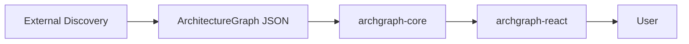

# Architecture Visualizer

A provider-independent TypeScript and React toolkit for exploring software architecture as an interactive 3D graph. Supply a graph, select a node, inspect its relationships and metadata, and follow its documentation links.

**This library does not connect to infrastructure providers or source control systems. Consumers are responsible for producing the graph passed into the viewer.**

## The boundary



External scripts, MCP tools, repository analysis, or IaC analysis can produce the same normalized input. The packages do not know its origin. There are no cloud/source-control SDKs, discovery plugins, Terraform parsers, MCP clients, backends, authentication, or AI agents in this project. No library code fetches data, fonts, textures, or models. Links navigate only when the user activates them. Consumer-provided renderers are responsible for their own behavior.

## Workspace

```text
architecture-visualizer/
  packages/core/     Graph model, Zod schemas, validation, pure utilities
  packages/react/    Viewer, scene, details panel, layout and rendering APIs
  apps/demo/         Vite application consuming public package exports
  examples/         Distributed-system JSON and custom-renderer example
  tests/            Browser interaction and offline-rendering checks
  scripts/          Independent tarball consumer smoke test
  docs/             Publishing and verification notes
```

## Run locally

Use Node.js 22.12+ (Node 24 is also supported) and pnpm 11.19.0. Install pnpm with your preferred package manager; `npm install -g pnpm@11.19.0` is one option.

```bash
pnpm install --frozen-lockfile
pnpm dev
```

Open http://127.0.0.1:5173. `pnpm dev` first builds both packages, then starts Vite. Changes to demo files hot reload. When editing package sources, run `pnpm --filter archgraph-core exec tsc -p tsconfig.build.json --watch` and `pnpm --filter archgraph-react exec vite build --watch` in separate terminals after the initial build. Rerun the React package build to refresh declarations after changing public types.

The demo contains a frontend, gateway, three services, two databases, a queue, worker, and shared library. Links use example.com placeholders. The demo owns its title, filters and legend; these do not live in either package.

## Graph format

```ts
import type { ArchitectureGraph } from 'archgraph-core';

const graph: ArchitectureGraph = {
  version: '1.0',
  groups: [{ id: 'platform', label: 'Platform' }],
  nodes: [
    {
      id: 'web',
      label: 'Web application',
      type: 'application',
      group: 'platform',
      tags: ['public'],
      description: 'Customer-facing interface',
      metadata: { team: 'Experience', language: 'TypeScript' },
      links: [
        {
          label: 'Source',
          href: 'https://example.com/source',
          type: 'source',
          external: true,
        },
      ],
    },
    { id: 'api', label: 'API', type: 'service', group: 'platform' },
  ],
  edges: [
    {
      source: 'web',
      target: 'api',
      type: 'calls',
      metadata: { protocol: 'HTTP' },
    },
  ],
};
```

`version`, `nodes`, `edges`, and `groups` are required; `metadata` is optional. Node IDs, labels and types are required. Edge source/target and group ID/label are required. Group `parent` references another group by ID. Node, edge, link and group fields follow the exported Zod schemas. Node and edge types are open strings. Arbitrary metadata uses `Record<string, unknown>`; use JSON-serializable values for portable graph files. React displays metadata as escaped text, never raw HTML.

Generic links accept HTTP(S), mailto, relative paths and fragments. Relative paths resolve against the consuming application's location. `external: true` opens a new tab with `noopener noreferrer`; otherwise links use normal same-tab navigation. Executable schemes, protocol-relative URLs, whitespace/control characters and backslashes are rejected. Percent-encode spaces in URLs. `icon` is reserved as a consumer hint; the default panel uses text labels.

Node visuals support `color` (six-digit hex) and `size` (0.25–2); edge visuals support `color`, `width` (0.5–8) and `dashed`. Layout positions are computed separately and never required in the schema. Schema objects are strict: add custom data to metadata, not new structural properties. IDs and other nonempty identity strings are trimmed during parsing. Version `1.0` is the only supported graph version.

See [the full sample](examples/distributed-system.json).

## Validation and core utilities

```ts
import {
  validateGraph,
  getDependencies,
  getConnectedSubgraph,
} from 'archgraph-core';
const result = validateGraph(untrustedJSON);
if (result.valid) {
  const dependencies = getDependencies(result.graph, 'web');
  const neighborhood = getConnectedSubgraph(result.graph, 'web', 2);
  // result.issues may still contain warnings/informational notices.
} else {
  console.error(result.issues); // structured severity/type/path/entity references
}
```

- Errors: malformed schema; duplicate node, group or supplied edge IDs; missing endpoints/groups/parent groups; cyclic group ancestry.
- Warnings: self-edges and duplicate `(source, target, type, label)` relationships. Different relationship types/labels are valid parallel edges.
- Info: orphan nodes with no valid incident relationship.
- Directed relationship cycles are valid. Group ancestry is a hierarchy, so group cycles are errors.

`ArchitectureGraphSchema` and the individual node, edge, group, link and visual schemas are exported. `validateGraphSemantics(graph)` is available when input is already schema-valid. `validateGraph(unknown)` combines both layers and returns a discriminated union; `graph` is available only when `valid` is true.

| API                                       | Meaning                                                                          |
| ----------------------------------------- | -------------------------------------------------------------------------------- |
| `getNode(graph, id)`                      | Node or `undefined`                                                              |
| `getOutgoingEdges` / `getIncomingEdges`   | Directed incident edges                                                          |
| `getDependencies` / `getDependents`       | Unique direct outgoing targets / incoming sources                                |
| `getNeighbors`                            | Unique nodes in either direction, excluding self                                 |
| `getConnectedSubgraph(graph, id, depth?)` | Undirected BFS neighborhood and its induced edges                                |
| `filterGraph(graph, options)`             | Filter nodes, prune dangling edges, retain referenced groups and their ancestors |

Utilities are pure and preserve graph node order. Connected traversal defaults to the entire connected component; depth 0 returns the seed, and a missing seed returns an empty graph. Negative/fractional depths throw. Utilities assume schema-valid input; validate untrusted JSON first.

Filters support `nodeIds`, `types`, `groupIds`, `tags`, `query`, and `predicate`. Conditions combine with AND; values within an array combine with OR. An empty array matches no nodes. Group filters match direct group membership; tags use any-match; text search checks label/type/description case-insensitively. Original metadata is retained. Inputs and metadata are not deep-frozen or copied by traversal helpers—treat graphs as immutable values.

## React usage

The unscoped package names are provisional. npm availability will be checked before publication; names can change if a collision is found. No packages have been published. Once published (or installed from local tarballs):

```bash
pnpm add archgraph-core archgraph-react react@~19.2.0 react-dom@~19.2.0 three@~0.182.0 @react-three/fiber@^9.4.0
```

```tsx
import { useState } from 'react';
import { ArchitectureViewer } from 'archgraph-react';
import 'archgraph-react/styles.css';

function Architecture({ graph }: { graph: ArchitectureGraph }) {
  const [selected, setSelected] = useState<string | null>(null);
  return (
    <div style={{ height: 700 }}>
      <ArchitectureViewer
        graph={graph}
        selectedNodeId={selected}
        onNodeSelect={(node) => setSelected(node?.id ?? null)}
      />
    </div>
  );
}
```

Import `ArchitectureGraph` as a type from `archgraph-core` in this example. Omitting `selectedNodeId` enables internal selection; `defaultSelectedNodeId` provides its initial value. Passing `null` means controlled empty selection. Callbacks report user intent, including `null` when clearing; controlled state changes only when the host updates the prop.

A single click selects without navigating. Selection emphasizes the node and incident edges, fades unrelated nodes, and shows description, tags, metadata, links, dependencies and dependents. Edge types, labels and metadata appear under each relationship. Empty-space click, the close button and Escape clear selection. Orbit/pan/zoom use pointer controls. The keyboard-accessible Browse nodes list also works when WebGL is unavailable. The scene falls back to this inspector workflow on rendering failure.

The viewer validates graph input before mounting the scene. Invalid graphs show an error panel; consumers can call `validateGraph` to expose all warnings themselves. Replace graph/filter/layout references when changing data so memoized computations update.

| Viewer prop / API                         | Purpose                                                                                         |
| ----------------------------------------- | ----------------------------------------------------------------------------------------------- |
| `highlightedNodeIds`                      | Additional emphasized nodes                                                                     |
| `filters` / `useFilteredGraph`            | Pure induced-graph filtering                                                                    |
| `layout="layered"` or function            | Deterministic automatic or custom layout                                                        |
| `nodeRenderers`                           | Per-type custom geometry                                                                        |
| `edgeStyle(edge)`                         | Custom color, width and dash overrides                                                          |
| `showEdgeLabels`                          | All relationship labels; incident labels show on selection by default                           |
| `showDetailsPanel` / `renderDetails`      | Hide or replace the inspector                                                                   |
| `className`, `style`, `ariaLabel`         | Host styling and accessible naming                                                              |
| `ref.resetCamera()`                       | Fit the visible graph, also available through the built-in button                               |
| `ref.captureScreenshot(options?)`         | PNG Blob of the current view with built-in labels; `includeLabels: false` exports geometry only |
| `showScreenshotButton`                    | Show the built-in Download PNG button (default true)                                            |
| `draggableNodes`                          | Opt in to dragging geometry or labels on a horizontal plane (demo enables this)                 |
| `nodePositions` / `defaultNodePositions`  | Controlled or initial manual position overrides, separate from the graph                        |
| `onNodePositionsChange` / `onNodeDragEnd` | Proposed position state during dragging and the final proposed position after release           |
| `ref.resetLayout()`                       | Clear manual position overrides; also available through Reset layout                            |

Filtering prunes the scene; details use the original graph to preserve architectural context. Filtered-out relationships are shown but cannot be selected until the host changes its filters. A selection hidden by filtering is visually cleared without firing a synthetic callback; it reappears if made visible again. This preserves externally controlled selection.

Drag nodes in the demo to rearrange them; drag the background to orbit. Edges follow moved nodes, and Escape cancels a drag. Positions survive filtering and camera resets. Reset layout restores automatic positions. Positions belong to view state, not the architecture schema; controlled applications can save them separately through `onNodePositionsChange`. See the [React package guide](packages/react/README.md) for controlled dragging and screenshot examples.

## Custom rendering and layout

```tsx
import type { NodeRendererProps, LayoutFunction } from 'archgraph-react';

function ServiceNode({ color, opacity, selected }: NodeRendererProps) {
  return (
    <mesh scale={selected ? 1.15 : 1}>
      <icosahedronGeometry args={[0.6, 0]} />
      <meshStandardMaterial color={color} transparent opacity={opacity} />
    </mesh>
  );
}

<ArchitectureViewer graph={graph} nodeRenderers={{ service: ServiceNode }} />;

const myLayout: LayoutFunction = (graph) =>
  new Map(graph.nodes.map((node, index) => [node.id, [index * 4, 0, 0]]));
<ArchitectureViewer graph={graph} layout={myLayout} />;
```

Custom renderers receive the node, selection/highlight/dimming state, color and opacity. Render local R3F geometry; the viewer owns positions, labels and click handlers. Honor the supplied state for consistent behavior. Unknown types receive a neutral box. `DefaultNodeRenderer`, `DefaultDetailsPanel` and `getNodeColor` are public extension helpers.

The automatic layout uses deterministic breadth-first layers, stable group/ID ordering, and seeded cyclic/disconnected components. Groups influence ordering and appear in labels; parent groups are modeled but not rendered as nested enclosures. `LayoutFunction` receives the full graph and returns a `ReadonlyMap<string, [number, number, number]>` for every node. Filtering preserves these positions; manual overrides apply afterward. Invalid custom positions throw a descriptive programming error. There is no provider-specific ranking.

Directed edges have arrowheads, curved offsets for parallel connections, loops for self-edges, and a deterministic color per arbitrary edge type. Explicit visual settings and then `edgeStyle` override defaults. There are no animations beyond damped camera controls. Rendering is on demand.

## Test and build

```bash
pnpm check                 # lint, typecheck, unit/behavior coverage, all builds
pnpm format:check
pnpm pack:packages         # artifacts/archgraph-{core,react}-0.1.0.tgz
pnpm test:consumer         # fresh, standalone Vite/TS app using those tarballs
pnpm exec playwright install chromium
pnpm test:browser          # real canvas, selection, filtering, links, reset, zero external requests
```

Core builds with TypeScript; React builds with Vite library mode and TypeScript declaration emission. The demo has no source aliases into the libraries. Package checks use an isolated temporary application, not workspace symlinks. No check publishes anything. See [publishing](docs/PUBLISHING.md) and [verification](docs/VERIFICATION.md).

## Dependency decisions

Core depends only on Zod. React depends on core and Drei; React, React DOM, Three.js and R3F are peer dependencies and are externalized from the published bundle. Drei is also externalized and installed as a normal dependency. This avoids embedding another React renderer or Three.js instance and supports custom R3F geometry in the host app. The currently tested React line is 19.2; peer ranges deliberately exclude 19.3 because the resolved R3F package does not declare support for it. TypeScript consumers should install the matching `@types/react`, `@types/react-dom`, and `@types/three` packages.

ESM and TypeScript declarations are exported; no CommonJS build is claimed. CSS is an explicit `archgraph-react/styles.css` export and is marked as a side effect. React is never bundled into the library. Static HTML labels avoid remote font loading. The demo's WebGL dependencies are sizable; production hosts can lazy-load the entire viewer when appropriate.

## V1 limits and next steps

This vertical slice targets small-to-medium documentation graphs, not massive graph analytics. Layout is simple and not crossing-minimized; dense graphs can overlap labels. Benchmark larger graphs before setting scale guarantees. Edge selection, saved/controlled camera state, collapsible groups and nested group boundaries remain future additive APIs. Consider SCC-aware layout, virtualized labels and an edge inspector next. No hidden provider discovery should be added to these packages; adapters belong in separate projects.

## License

MIT. npm publication requires owner approval; see the publishing checklist.
